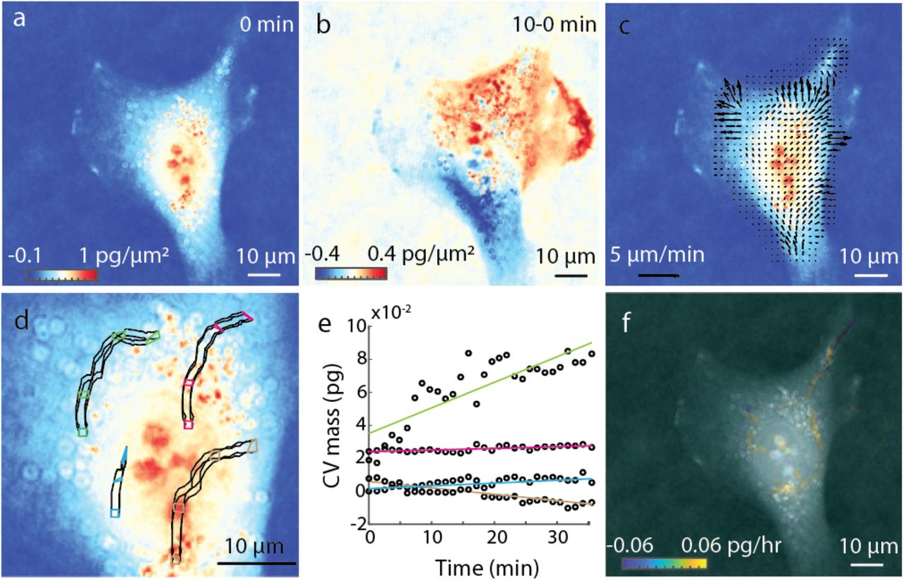

# LVING : a tool for computing intracellular growth dynamics

Lagrangian velocimetry for intracellular net growth (LVING) provides high resolution maps of intracellular biomass production and degradation. LVING uses quantitative phase imaging (QPI) measurements of cell mass and the intracellular velocity of mass transport to quantify the balance of growth and degradation within intracellular control volumes.

For details of computation and various applications of LVING, checkout the preprint on [biorXiv](https://doi.org/10.1101/2023.09.08.553132). The following applications are demonstrated:

* intracellular growth mapping during various stages of cell cycle
* modes of growth inhibition in cells during chemotherapy
* biomass degradation in cells during autophagy

## How to use LVING code

Start with the main file: `LVING_VelocityGridProfile.m`</b>

Set the parameters for computation in the first section of the main file. Define the following values: </b>

**fdir** : path to the mat microscopy image data

**tcg** : number of frames averaged over time </b>

**xcg** : window size for spatial averaging of SSD, also size of control volume for tracking </b>

**gs** : SSD window size, chose an odd number </b>

**numf** : total number of time points considered for calculation </b>

**sgap** : difference bwn frames undergoing SSD, must be less than (numf-tcg) </b>

**bgap** : difference between frames when computing velocity for grid interpolation correction </b>

**medfiltsz** : median filter size </b>

**pxl_conv** : pixel size for imaging magnification in  &mu;m</b>

**Ref_inc** : refractive index increment in &mu;m3/pg </b>

**oplf** : wavelength of illumination light in &mu;m </b>

**Pixel_area** : pixel size in &mu;m (pxl_conv*pxl_conv)</b>

**w** : SSD search window size

Run the code using a 2D time lapse image input.

Download an example dataset [here](add zenodo dataset link here!!!)